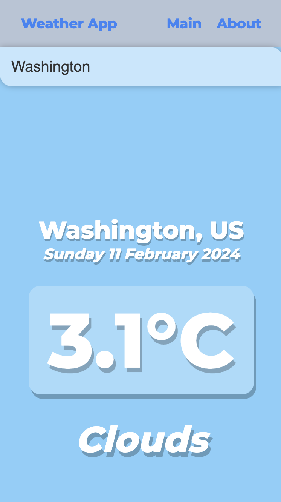

# JWeather Viewer 🌦

Welcome to the JWeather Viewer, a simple yet powerful mobile weather application designed to provide you with real-time weather updates at your fingertips. This project aims to deliver accurate weather forecasts in a user-friendly interface, making it easier for you to plan your day.

## Features 🌟

- **Real-Time Weather Updates:** 🌡 Get the latest weather information for your location or any city worldwide.
- **User-Friendly Interface:** 📱 Enjoy a clean, intuitive design that makes navigating through weather forecasts a breeze.
- **Customizable Settings:** ⚙️ Tailor the app to your preferences by selecting which weather details you wish to view.
- **Multi-City Search:** 🌍 Keep track of the weather in multiple cities, ideal for planning travel or checking on friends and family.

## Getting Started 🚀

To get started with JWeather Viewer, simply visit the following link:

  

This will take you directly to the web application, where you can immediately begin using all its features without the need for installation or registration.

## Screenshots 📸

Here are some screenshots of the JWeather Viewer in action:

  

## How to Contribute 💡

We welcome contributions from the community! If you're interested in improving the JWeather Viewer, please follow these steps:

1. Fork the repository.
2. Create a new branch for your feature or bug fix.
3. Commit your changes.
4. Push your branch and open a pull request.

## License 📄

JWeather Viewer is open-source software licensed under the MIT license. See the LICENSE file for more details.
